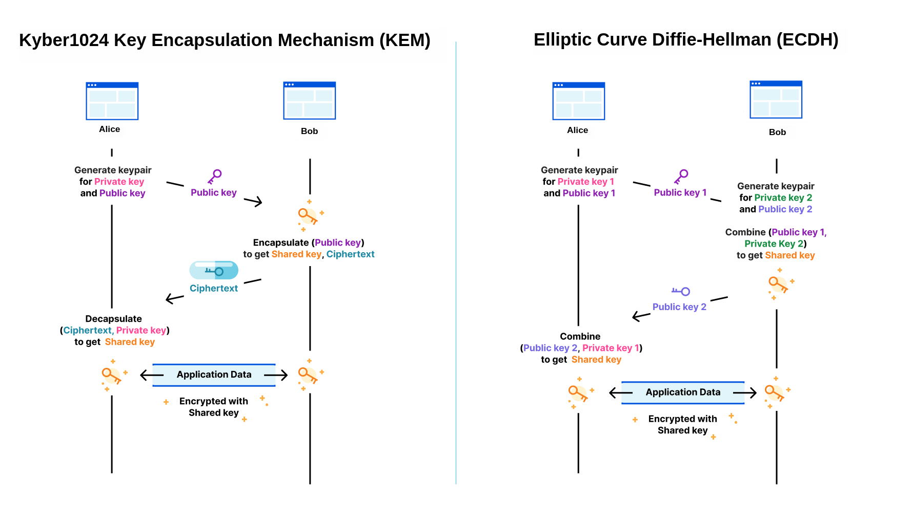

# Amnezichat Protocol

## Overview
Amnezichat is a secure, privacy-focused messaging protocol designed to ensure that no logs are retained and that all message data is stored exclusively in the server's RAM. The protocol uses quantum-resistant cryptographic techniques to provide strong end-to-end encryption, forward secrecy, and defense against traffic analysis.

## Cryptographic Components
- **Authentication:** EdDSA (Edwards-curve Digital Signature Algorithm) & Dilithium5 (Quantum-resistant)
- **Key Exchange:** ECDH (Elliptic-curve Diffie-Hellman) & Kyber1024 (Quantum-resistant)
- **Encryption:** ChaCha20-Poly1305 (Authenticated encryption)
- **Key Derivation Function (KDF):** Argon2id
- **Data Storage Protection:** Local identity keys are encrypted with ChaCha20-Poly1305 and secured using Argon2id with a user-specified password.

## Hybrid Key Exchange Diagram:

## Protocol Design
### 1. Session Establishment
- Clients initiate a session by generating ephemeral key pairs.
- A key exchange is performed using ECDH and Kyber1024 to derive a shared secret.
- Both parties authenticate using EdDSA and Dilithium5 signatures.
- A session key is derived from the shared secret using a cryptographic hash function.

### 2. Secure Messaging
- Each message is encrypted using ChaCha20-Poly1305 with the session key.
- Forward and backward secrecy is ensured by generating new ephemeral keys periodically.
- Messages are padded to a fixed length to mitigate traffic analysis attacks.
- To resist AI-guided Traffic Analysis (DAITA), encrypted dummy data is sent at random intervals.

### 3. Group Messaging
- Pre-Shared Key (PSK) derived from a room password using Argon2id is used to encrypt group messages.
- Each participant in a group shares a common PSK for message encryption.

### 4. Data Retention Policy
- Messages are stored only in RAM and wiped automatically after 10 minutes.
- No persistent logs or metadata are retained by the server.
- Server resets result in complete data erasure.

## Security Considerations
- Users must ensure their local devices are secure to prevent key theft.
- Strong passwords should be used for encrypting identity keys.

## License
Amnezichat is distributed under the GPLv3 License. See `LICENSE` for more information.

## Support & Donations
To support development, consider donating:
- **Monero (XMR):** 88a68f2oEPdiHiPTmCc3ap5CmXsPc33kXJoWVCZMPTgWFoAhhuicJLufdF1zcbaXhrL3sXaXcyjaTaTtcG1CskB4Jc9yyLV
- **Bitcoin (BTC):** bc1qn42pv68l6erl7vsh3ay00z8j0qvg3jrg2fnqv9

