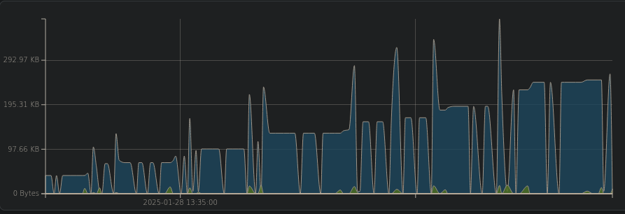
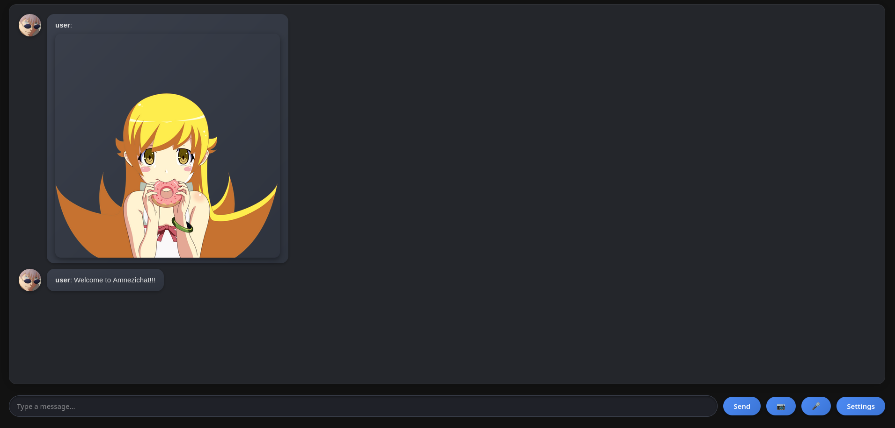

  <a href="README.md">🇺🇸 English</a> |
  <a href="README_TR.md">🇹🇷 Türkçe</a>

# Amnezichat

## Anti-forensic and secure messenger
<!-- DESCRIPTION -->
## Description:

Amnezichat offers a highly secure and privacy-focused messaging experience by ensuring that no logs are retained and all message data is stored exclusively in the server's RAM. This approach significantly enhances user privacy because RAM storage is inherently volatile data is automatically erased when the server is powered down or restarted, leaving no trace of already end-to-end encrypted past communications.

<!-- FEATURES -->
## Features:

- Client-side quantum-resistant E2E message encryption

- Forward and backward secrecy for one-to-one chats

- Group chat support using PSK (pre-shared-key)

- Server runs even on cheapest hardware

- Each message is stored encrypted in server's RAM and wiped after 24 hours

- All traffic is routed over Tor/I2P network by default

- Docker support

- Built in Rust

## Comparison chart with other messengers:

## Technical details:

- Defense against AI-guided Traffic Analysis (DAITA) by sending encrypted dummy data at random intervals and padding all messages to a fixed length except files

- [Amnezichat Protocol](PROTOCOL.md) for end-to-end encryption
- Stores identity keys in local storage encrypted with ChaCha20-Poly1305 and Argon2id KDF with an user specified password

### Amnezichat Protocol:
- EdDSA and Dilithium5 for authentication, ECDH and Kyber1024 for key exchange, encryption using ChaCha20-Poly1305

<!-- INSTALLATION -->
## Server setup:

    sudo apt update
    sudo apt install curl build-essential git
    curl https://sh.rustup.rs -sSf | sh -s -- -y
    git clone https://git.disroot.org/UmutCamliyurt/Amnezichat.git
    cd Amnezichat/server/
    cargo build --release
    cargo run --release

## Server setup with Docker:
    
    sudo apt update
    sudo apt install docker.io git
    git clone https://git.disroot.org/UmutCamliyurt/Amnezichat.git
    cd Amnezichat/server/
    docker build --network=host -t amnezichatserver:latest .
    docker run --network=host amnezichatserver:latest

## Client setup:

**For Web UI connect to http://localhost:8000**

    sudo apt update
    sudo apt install curl build-essential git tor xterm
    sudo systemctl enable --now tor.service
    curl https://sh.rustup.rs -sSf | sh -s -- -y
    git clone https://git.disroot.org/UmutCamliyurt/Amnezichat.git
    cd Amnezichat/client/
    cargo build --release
    cargo run --release

## Client setup with Docker:

    sudo apt update
    sudo apt install docker.io git
    git clone https://git.disroot.org/UmutCamliyurt/Amnezichat.git
    cd Amnezichat/client/
    docker build --network=host -t amnezichat .
    xhost +local:docker
    docker run --rm \
    --network=host \
    -e DISPLAY=$DISPLAY \
    -v /tmp/.X11-unix:/tmp/.X11-unix \
    --env QT_X11_NO_MITSHM=1 \
    amnezichat:latest

## Client setup with Nix:

    cd ./client
    nix develop --extra-experimental-features nix-command --extra-experimental-features flakes
    cargo build --release
    cargo run --release

## Requirements:

- [Rust](https://www.rust-lang.org), [Tor](https://gitlab.torproject.org/tpo/core/tor), [I2P](https://i2pd.website/)

<!-- SCREENSHOT -->
## Screenshot:

<!-- MIRRORS -->
## Git Mirrors

You can access **Amnezichat** source code from multiple mirror repositories:

- 🔗 **[Disroot Main Repository](https://git.disroot.org/UmutCamliyurt/Amnezichat)**
- 🔗 **[Codeberg Mirror](https://codeberg.org/umutcamliyurt/Amnezichat)**
- 🔗 **[GitHub Mirror](https://github.com/umutcamliyurt/Amnezichat)**
- 🔗 **[NemesisCloud Mirror](http://c2vz25ugnpnrqmzcksavlzyxmy3eavcxnyxjbjqkez2svoj5dlc5x7id.onion/umutcamliyurt/Amnezichat)**
- 🔗 **[EveryPizza Mirror](https://nemesisgit.everypizza.im/nemesis/Amnezichat)**

<!-- LICENSE -->
## License

Distributed under the GPLv3 License. See `LICENSE` for more information.

## Donate to support development of this project!

**Monero(XMR):** 88a68f2oEPdiHiPTmCc3ap5CmXsPc33kXJoWVCZMPTgWFoAhhuicJLufdF1zcbaXhrL3sXaXcyjaTaTtcG1CskB4Jc9yyLV

**Bitcoin(BTC):** bc1qn42pv68l6erl7vsh3ay00z8j0qvg3jrg2fnqv9
