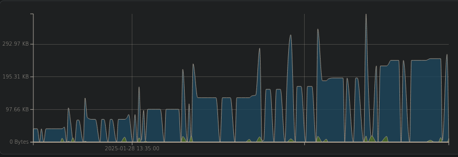
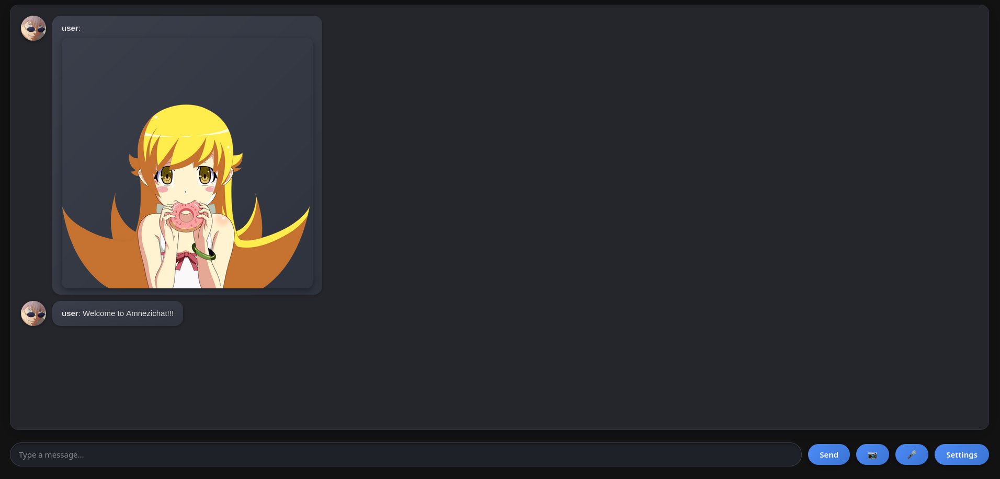

  <a href="README.md">🇺🇸 English</a> |
  <a href="README_TR.md">🇹🇷 Türkçe</a>

# Amnezichat

## İz bırakmayan güvenli mesajlaşma
<!-- AÇIKLAMA -->
## Açıklama:

Amnezichat, hiçbir kayıt tutulmamasını ve tüm mesaj verilerinin yalnızca sunucunun RAM'inde saklanmasını sağlayarak son derece güvenli ve gizlilik odaklı bir mesajlaşma deneyimi sunar. Bu yaklaşım, kullanıcı gizliliğini önemli ölçüde artırır çünkü RAM depolaması doğası gereği geçicidir; sunucu kapatıldığında veya yeniden başlatıldığında veri otomatik olarak silinir ve uçtan uca şifrelenmiş geçmiş iletişimlerin hiçbir izi kalmaz.

<!-- ÖZELLİKLER -->
## Özellikler:

- İstemci tarafında kuantum dirençli uçtan uca mesaj şifreleme

- Bire bir sohbetler için forward ve backward secrecy

- PSK (önceden paylaşılan anahtar) kullanarak grup sohbeti desteği

- En ucuz donanımda bile çalışabilen sunucu

- Her mesaj sunucunun RAM'inde şifreli olarak saklanır ve 10 dakika sonra silinir

- Tor/I2P desteği

- Docker desteği

- Rust ile geliştirilmiştir

## Diğer mesajlaşma uygulamalarıyla karşılaştırma tablosu:

| Özellik                  | **Amnezichat**         | **Signal**            | **Simplex**           | **WhatsApp**                    | **Telegram**           | **Cwtch**             |
|--------------------------|---------------------------|---------------------------|---------------------------|-------------------------------------|---------------------------|------------------------------|
| **Geçici Mesajlar**      | Tamamen geçici            | İsteğe bağlı              | Tamamen geçici            | İsteğe bağlı                        | İsteğe bağlı              | Tamamen geçici               |
| **Şifreleme**            | Kuantum dirençli      | Kuantum dirençli      | Kuantum dirençli      | Signal Protokolü *(kapalı kaynak)* | Kısmi                     | Tor tabanlı              |
| **Forward Secrecy**     | ✅ Evet                   | ✅ Evet                   | ✅ Evet                   | ✅ Evet                             | ⚠️ Kısmi                 | ✅ Evet                       |
| **Trafik Yönlendirme**   | 🔄 İsteğe bağlı (Tor/I2P) | ❌ Hayır                  | 🔄 İsteğe bağlı           | ❌ Hayır                            | ❌ Hayır                  | ✅ Tor üzerinden              |
| **Veri Saklama**         | 🗑️ Yok                    | 🗑️ Yok                   | 🗑️ Yok                   | ❌ Meta veri silinmez            | ❌ Meta veri silinmez | 🗑️ Yok                        |
| **Grup Sohbeti**         | 🔐 Evet (PSK tabanlı)     | ✅ Evet                   | ✅ Evet                   | ✅ Evet                             | ✅ Evet                   | ✅ Evet                       |
| **FOSS (Açık Kaynak)**   | ✅ Evet                   | ✅ Evet                   | ✅ Evet                   | ❌ Hayır                            | ❌ Hayır                  | ✅ Evet                       |
| **Kendin Barındırabilir**| ✅ Evet                   | ❌ Hayır                  | ✅ Evet                   | ❌ Hayır                            | ❌ Hayır                  | ✅ Evet                       |
| **Sunucu Gereksinimi**   | ✅ Düşük maliyetli donanım| ❌ Orta düzey             | ❌ Orta düzey             | ❌ Yüksek                           | ❌ Orta/Yüksek           | ✅ Sadece P2P         |

## Teknik detaylar:

- Şifreli sahte veriler göndererek ve tüm mesajları sabit bir uzunluğa sabitleyerek AI destekli trafik analizine (DAITA) karşı savunma

- Uçtan uca şifreleme için [Amnezichat Protokolü](PROTOCOL_TR.md)
- Kimlik anahtarlarını, kullanıcı tarafından belirlenen bir şifre ile ChaCha20-Poly1305 ve Argon2id KDF kullanarak yerel depolamada şifreler

### Amnezichat Protokolü:
- Kimlik doğrulama için EdDSA ve Dilithium5, anahtar değişimi için ECDH ve Kyber1024, şifreleme için ChaCha20-Poly1305

<!-- KURULUM -->
## İstemci kurulumu:

    sudo apt update
    sudo apt install curl build-essential git tor xterm
    sudo systemctl enable --now tor.service
    curl https://sh.rustup.rs -sSf | sh -s -- -y
    git clone https://git.disroot.org/UmutCamliyurt/Amnezichat.git
    cd Amnezichat/client/
    cargo build --release
    cargo run --release

## Docker ile istemci kurulumu:

    sudo apt update
    sudo apt install docker.io git
    git clone https://git.disroot.org/UmutCamliyurt/Amnezichat.git
    cd Amnezichat/client/
    docker build --network=host -t amnezichat .
    xhost +local:docker
    docker run --rm \
    --network=host \
    -e DISPLAY=$DISPLAY \
    -v /tmp/.X11-unix:/tmp/.X11-unix \
    --env QT_X11_NO_MITSHM=1 \
    amnezichat:latest

## Gereksinimler:

- [Rust](https://www.rust-lang.org), [Tor](https://gitlab.torproject.org/tpo/core/tor), [I2P](https://i2pd.website/)

<!-- EKRAN GÖRÜNTÜSÜ -->
## Ekran görüntüsü:

<!-- AYNALAR -->
## Git Aynaları

**Amnezichat** kaynak koduna birden fazla yedek (ayna) depo üzerinden erişebilirsiniz:

- 🔗 **[Ana Depo (Disroot)](https://git.disroot.org/UmutCamliyurt/Amnezichat)**
- 🔗 **[GitHub Aynası](https://github.com/umutcamliyurt/Amnezichat)**

<!-- LİSANS -->
## Lisans

GPLv3 Lisansı altında dağıtılmaktadır. Daha fazla bilgi için `LICENSE` dosyasına bakın.

## <a href="CONTRIBUTORS_TR.md">Destekçiler</a>

## Bu projenin geliştirilmesini desteklemek için bağış yapın!

**Monero(XMR):** 88a68f2oEPdiHiPTmCc3ap5CmXsPc33kXJoWVCZMPTgWFoAhhuicJLufdF1zcbaXhrL3sXaXcyjaTaTtcG1CskB4Jc9yyLV

**Bitcoin(BTC):** bc1qn42pv68l6erl7vsh3ay00z8j0qvg3jrg2fnqv9
